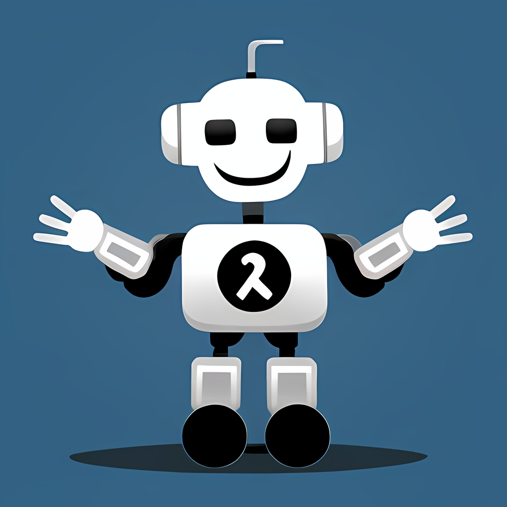

# Chatbot Program

## Description
This is a chatbot program designed to interact with users and provide useful functionalities.

## Tools
The following tools are available for users:
- basic.py: Basic functionalities of the chatbot.
- mattermost_api.py: API for Mattermost integration.
- multimedia.py: Multimedia functionalities.
- openai_api.py: API for OpenAI integration.
- psychedelic_bot.py: Psychedelic bot functionalities.
- textgen_api.py: Text generation API.
- tools/update_readme.py: Tool for updating README.
- update.sh: Shell script for updating the program.

## Commands
The following commands are available for users in the `psychedelic_bot.py`:
- "caption": Generates a text caption for an image. Example: `caption`. Requires an image file to be attached.
- "pix2pix": Transforms an image based on the provided instruction. Example: `pix2pix change her hair to red`. Requires an image file to be attached.
- "2x": Upscales an image by 2 times. Example: `2x`. Requires an image file to be attached. Example: `2x`.
- "4x": Upscales an image by 4 times. Example: `4x`. Requires an image file to be attached. Example: `4x`.
- "llm": Generates a text chat completion from a local LLM model. Example: `llm Are you sentient?`.
- "storyteller": Generates a story attached image(s). Example: `storyteller`. Requires an image file to be attached.
- "summary": Generates a summary of a YouTube video. Example: `summary https://www.youtube.com/watch?v=dQw4w9WgXcQ`.

## Authors
- bunnyh
- ronaz

## License
This project is licensed under the MIT License.

